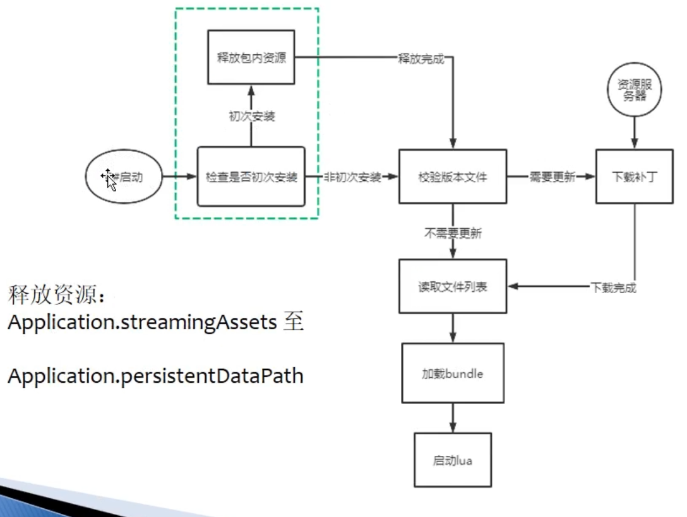
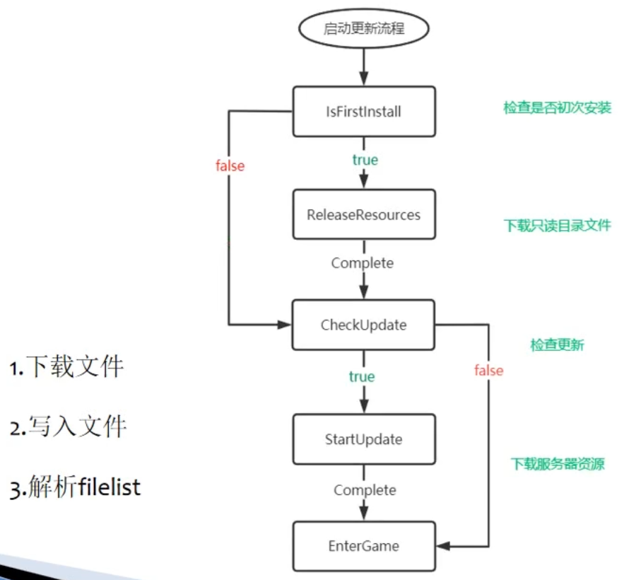

# 热更新流程

## 热更新方案

- 整包
  - 策略：完整更新资源放在包内
  - 优点：首次更新少
  - 缺点：安装包下载时间长，首次安装久
- 分包
  - 策略：包内放少量或者不放更新资源
  - 优点：安装包小，下载快，安装极速
  - 缺点：首次更新时间久

  

整包模式需要在初次安装后拷贝资源。

## 热更新代码

  

## 初次安装

- 初次安装时，只读目录有热更资源，可读写目录没有热更资源。应该释放资源到可读写目录。
- 释放资源时最后写入 filelist ，检测是否是初次安装只需判断 filelist 文件是否存在，这样即使上次释放资源时用户异常退出也能保证逻辑正确。

## 检查更新

- 下载资源服务器的 filelist 文件
- 对比文件信息和本地是否一致

## 文件路径

- 只读目录：Application.streamingAssetsPath/**ui/testui.prefab.ab**
- 可读写目录：Application.persistentDataPath/**ui/testui.prefab.ab**
- 资源服务器：http://127.0.0.1/AssetBundles/**ui/testui.prefab.ab**

只需要知道后面这一段相对路径，就可以任意操作。